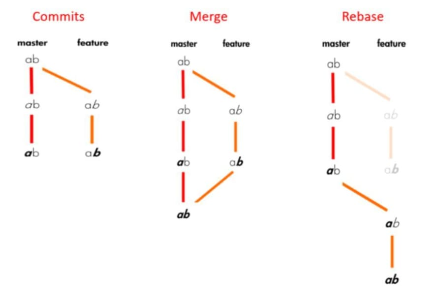
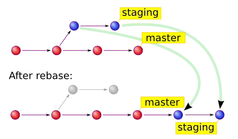

  

# Abstract
#
## Git
#### Git version
Verify xem Git đã được cài đặt hay chưa bằng cách sử dụng lệnh sau trong command prompt.

> git --version

#### Basic Command
> git config
> 
Một trong các lệnh được dùng nhiều nhất là git config, có thể được cấu hình cho cá nhân với các giá trị của emails, thuật toán cho diff, username và file format,… Ví dụ, command bên dưới có thể dùng cho email:

>git config --global user.email thienhang@google.com

>git init

Lệnh này được dùng để tạo GIT repository. Cách dùng:

> git init
> git add

Lệnh git add có thể được dùng để thêm file vào index. Ví dụ, command sau có thể thêm một file có tên temp.txt vào thư mục local vào index:

> git add temp.txt
> git clone

Lệnh git clone được dùng với mục đích check out. Nếu respository phụ thuộc vào server từ xa, sử dụng:\

> git clone alex@93.188.160.58:/path/to/repository

Ngược lại, nếu một bản repository đang hoạt động tại local đã được tạo, hãy dùng:
> git clone /path/to/repository
> git commit
Lệnh git commit được dùng để commit thay đổi từ đầu. Hãy lưu ý là thay đổi không được áp dụng cho repository của server từ xa :

> git commit –m “Message to go with the commit here”
> git status

Lệnh git status hiển thị dnah sách thay đổi của files được thêm hoặc commited. Cách dùng:
> git status

> git push

git push là một lệnh  được sử dụng nhiều của git. Một lệnh push đơn giản sẽ gửi thay đổi tới master branch của repositorys của server từ xa được chỉ định  với một thư mục. Ví dụ:

> git push origin master
> git checkout

Lệnh git checkout có thể được dùng để tạo branched hoặc chuyển giữa chúng. Ví dụ, lệnh sau tạo một brach mới và chuyển tới nó;

> command git checkout -b <branch-name>

Để chuyển từ branch này sang branch khác, hãy dùng:
> git checkout <branch-name>
> git remote

Lệnh git remote giúp user kết nối tới repository từ xa. Lệnh sau liệt kê danh sách repositories từ xa mà đang được cấu hình::

> git remote –v

Lệnh này cũng giúp người dùng kết nối từ repository ở local tới remote server::

> git remote add origin <93.188.160.58>
> git branch

Lệnh git branch có thể được dùng để liệt kê, tạo hoặc xóa branches. Để liệt kê tất cả các branchs đang có trong repositories, hãy dùng:

git branch
Để xóa branch:

> git branch –d <branch-name>

> git pull

Để merge tất cả các thay đổi trên remote repository tới thư mục đang chạy trên local, pull command cần được dùng. Cách dùng:

> git pull
> git merge

Lệnh git merge được dùng để merge một branch vào một branch đang hoạt động. Cách dùng:

> git merge <branch-name>
> git diff

Lệnh git diff được dùng để liệt kê xung đột. Để hiển thị xung đột với base file, sử dụng:

> git diff --base <file-name>

Command bên dưới được dùng để hiển thị mâu thuẫn giửa branches sắp được merge:

> git diff <source-branch> <target-branch>

Để hiển thị các mâu thuẫn hiện tại, sử dụng:

> git diff
> git tag

Tagging được dùng để đánh dấu commit với một handle đơn giản. Ví dụ có thể là:

> git tag 1.1.0 <insert-commitID-here>
> git log

Chạy git log cho ra danh sách commits trên branch  với thông tin cần thiết. Một output đơn giản có thể là:

>commit 15f4b6c44b3c8344caasdac9e4be13246e21sadw
 Author: Alex Hunter <alexh@gmail.com>
 Date:   Mon Oct 1 12:56:29 2016 -0600

>git reset

Để reset index và thư mục đang chạy với lần commit cuối cùng, git reset command được dùng. Cách dùng:

>git reset --hard HEAD
git rm
git rm có thể được dùng để loại bỏ files từ torng index và thư mục đang hoạt động. Cách dùng:

> git rm filename.txt
> git stash

Là một trong số ít lệnh cơ bản ít được biết đến, git stash giúp bạn lưu lại thay đổi mà chưa được commited ngay lập tức, nhưng tạm thời. Sử dụng:

> git stash
git show

Để hiển thị thông tin về bất kỳ git object nào, hãy dùng git show. Ví dụ:

> git show

> git fetch

git fetch cho phép user tải tất cả object từ remote repository mà không có trên thư mục local. Ví dụ sử dụng:

> git fetch origin
> git ls-tree

Để hiện tree object với tên và mode của mỗi item, và giá trị blob’s SHA-1, sử dụng command, hãy dùng command git ls-tree. Ví dụ:

git ls-tree HEAD
git cat-file
Sử dụng giá trị SHA-1, hiển thị loại của object bằng cách dùng command git cat-file. Ví dụ:

git cat-file –p d670460b4b4aece5915caf5c68d12f560a9fe3e4
git grep
git grep giúp người dùng tìm kiếm qua nội dung dạng cây cho cụm từ và từ. Ví dụ, để tìm từ www.hostinger.com trong tất cả các file:

git grep "www.hostinger.vn"
gitk
gitk là một giao diện đồ họa cho local repository có thể được kích hoạt bằng cách gõ và chạy:

gitk

git instaweb
Với lệnh git instaweb, một web server có thể chạy  command, một web server có thể chạy trên local repository. Một trình duyệt web có thể tự động được chỉ định tới nó. Ví dụ:

git instaweb –httpd=webrick
git gc
Để tối ưu repository với garbage collection, sẽ dọn dẹp các file không cần thiết và tối ưu chúng, sử dụng:

git gc
git archive
Lệnh git archive giúp người dùng tạo file zip hoặc file tar chứa các thành phần của một cây repository. Ví dụ:

git archive --format=tar master
git prune
Qua lệnh git prune, objects không có bất kỳ pointers nào sẽ được xóa. Cách dùng:

git prune
git fsck
Để thực hiện integrity check của git file system, sử dụng command git fsck. Bất kỳ object lỗi nào cũng được xác định:

git fsck
git rebase
Lệnh git rebase được dùng để áp dụng lại commits của một branch khác.  Ví dụ:

git rebase master
## Git Rebase

Git Rebase là một chức năng được dùng khi gắn nhánh đã hoàn thành công việc vào nhánh gốc . Về mặt nội dung thì là việc điều chỉnh nhánh công việc gắn vào với nhánh gốc nên các commit sẽ được đăng kí theo thứ tự gắn vào . Chính vì thế sẽ có đặc trưng là dễ nhìn hơn sau khi xác nhận commit .

  

##### Chúng ta sẽ thực hiện công việc gắn các nhanh con vào nhánh gốc. Khi gắn nguượ lai, các nhánh con sẽ bị xóa hết và chỉ còn lại nhánh gốc.

