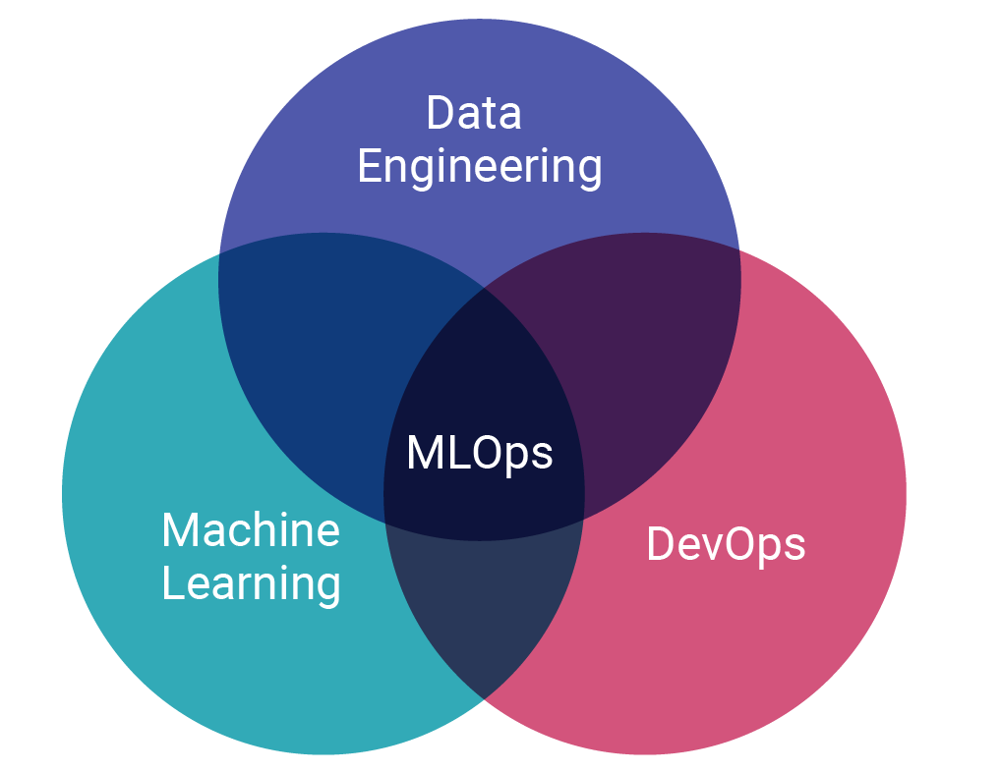

<div id="top"></div>

[![Contributors][contributors-shield]][contributors-url]
[![Forks][forks-shield]][forks-url]
[![Stargazers][stars-shield]][stars-url]
[![Issues][issues-shield]][issues-url]
[![MIT License][license-shield]][license-url]
[![LinkedIn][linkedin-shield]][linkedin-url]

<!-- PROJECT LOGO -->
<br />
<div align="center">
  <a href="https://github.com/othneildrew/Best-README-Template">
    
  </a>

  <h1 align="center">Machine Learning Operations</h1>

  <p align="center">
    MLOps Là một trong những lĩnh vực mới nổi, được quan tâm bởi các nhà khoa học dữ liệu, kỹ sư ML và những người đam mê AI. MLOPs đươc định nghĩa là: Khả năng áp dụng các nguyên tắc của DevOps cho các ứng dụng học máy. (Theo <a href="https://github.com/cdfoundation/sig-mlops/blob/main/roadmap/2022/MLOpsRoadmap2022.md">Continuous Delivery Foundation SIG MLOps</a>). Trong phạm vi của bài viết này nhóm chúng tôi sẽ cố gắng đưa ra những định nghĩa ngắn nhất để giúp cho những ai đang bắt đầu tìm hiểu về lĩnh vực này tiếp cận một cách dễ dàng hơn. Chúng tôi rất mong nhận được góp ý của các bạn khi có những nội dung chưa chính xác. Thay mặt nhóm tôi xin trân thành cảm ơn.
    <br />
    <br />
    <a href="https://github.com/open-thienhang-com/open">View Demo</a>
    ·
    <a href="https://github.com/open-thienhang-com/open/issues">Report Bug</a>
    ·
    <a href="https://github.com/open-thienhang-com/open/issues">Request Feature</a>
  </p>
</div>

<!-- TABLE OF CONTENTS -->
<details>
  <summary>Nội dung chính của bài viết</summary>
  <ol>
    <li>
      <a href="#about-the-project">About The Project</a>
      <ul>
        <li><a href="#built-with">Built With</a></li>
      </ul>
    </li>
    <li>
      <a href="#getting-started">Getting Started</a>
      <ul>
        <li><a href="#prerequisites">Prerequisites</a></li>
        <li><a href="#installation">Installation</a></li>
      </ul>
    </li>
    <li><a href="#usage">Usage</a></li>
    <li><a href="#roadmap">Roadmap</a></li>
    <li><a href="#contributing">Contributing</a></li>
    <li><a href="#license">License</a></li>
    <li><a href="#contact">Contact</a></li>
    <li><a href="#acknowledgments">Acknowledgments</a></li>
  </ol>
</details>

<!-- ABOUT THE PROJECT -->
## About The Project

[![Product Name Screen Shot][product-screenshot]](https://thienhang.com)

MLops (Machine Learning Operations) là một hệ sinh thái liên quan đến quản lý và triển khai mô hình học máy (machine learning models) trong các ứng dụng thực tế. Nó bao gồm các quy trình, công cụ và kỹ thuật để phát triển, đưa vào sản xuất và duy trì các mô hình học máy.

Trong tương lai, MLops được kỳ vọng sẽ phát triển mạnh mẽ do nhu cầu ngày càng tăng của các doanh nghiệp về các ứng dụng học máy. Điều này có nghĩa là các doanh nghiệp cần tìm cách đưa các mô hình học máy vào sản xuất và duy trì chúng một cách hiệu quả, đồng thời đảm bảo tính ổn định và bảo mật của hệ thống.

Một số hướng phát triển của MLops trong tương lai bao gồm:

Tích hợp với các nền tảng đám mây: Các công nghệ MLops sẽ cần được tích hợp với các nền tảng đám mây để tăng tính linh hoạt và dễ dàng triển khai.

Tăng cường tính bảo mật: Đảm bảo tính bảo mật của các mô hình học máy và dữ liệu là một yếu tố cực kỳ quan trọng trong MLops.

Tăng cường tính tự động: Tính tự động sẽ được tăng cường để giảm thiểu công sức và thời gian cần thiết để phát triển và triển khai các mô hình học máy.

Tăng cường khả năng quản lý: Tăng cường khả năng quản lý để đảm bảo sự phát triển và duy trì các mô hình học máy là một nhiệm vụ quan trọng của MLops.

Mọi người có thể tham gia vào lĩnh vực MLops bao gồm các chuyên gia học máy, các kỹ sư phần mềm, chuyên gia về dữ liệu, các nhà phát triển phần mềm, các chuyên gia về đám mây và an ninh mạng, và những người có đam mê về các công nghệ mới và khả năng giải quyết vấn đề.

<p align="right">(<a href="#top">back to top</a>)</p>

### Built With

This section should list any major frameworks/libraries used to bootstrap your project. Leave any add-ons/plugins for the acknowledgements section. Here are a few examples.

* [Next.js](https://nextjs.org/)
* [React.js](https://reactjs.org/)
* [Vue.js](https://vuejs.org/)
* [Angular](https://angular.io/)
* [Svelte](https://svelte.dev/)
* [Laravel](https://laravel.com)
* [Bootstrap](https://getbootstrap.com)
* [JQuery](https://jquery.com)

<p align="right">(<a href="#top">back to top</a>)</p>

<!-- GETTING STARTED -->
## Getting Started

This is an example of how you may give instructions on setting up your project locally.
To get a local copy up and running follow these simple example steps.

### Prerequisites

This is an example of how to list things you need to use the software and how to install them.

* npm

  ```sh
  npm install npm@latest -g
  ```

### Installation

_Below is an example of how you can instruct your audience on installing and setting up your app. This template doesn't rely on any external dependencies or services._

1. Get a free API Key at [https://example.com](https://example.com)
2. Clone the repo

   ```sh
   git clone https://github.com/your_username_/Project-Name.git
   ```

3. Install NPM packages

   ```sh
   npm install
   ```

4. Enter your API in `config.js`

   ```js
   const API_KEY = 'ENTER YOUR API';
   ```

<p align="right">(<a href="#top">back to top</a>)</p>

<!-- USAGE EXAMPLES -->
## Usage

Use this space to show useful examples of how a project can be used. Additional screenshots, code examples and demos work well in this space. You may also link to more resources.

_For more examples, please refer to the [Documentation](https://example.com)_

<p align="right">(<a href="#top">back to top</a>)</p>

<!-- ROADMAP -->
## Roadmap

* [x] Add Changelog
* [x] Add back to top links
* [ ] Add Additional Templates w/ Examples
* [ ] Add "components" document to easily copy & paste sections of the readme
* [ ] Multi-language Support
  * [ ] Chinese
  * [ ] Spanish

See the [open issues](https://github.com/othneildrew/Best-README-Template/issues) for a full list of proposed features (and known issues).

<p align="right">(<a href="#top">back to top</a>)</p>

<!-- CONTRIBUTING -->
## Contributing

Contributions are what make the open source community such an amazing place to learn, inspire, and create. Any contributions you make are **greatly appreciated**.

If you have a suggestion that would make this better, please fork the repo and create a pull request. You can also simply open an issue with the tag "enhancement".
Don't forget to give the project a star! Thanks again!

1. Fork the Project
2. Create your Feature Branch (`git checkout -b feature/AmazingFeature`)
3. Commit your Changes (`git commit -m 'Add some AmazingFeature'`)
4. Push to the Branch (`git push origin feature/AmazingFeature`)
5. Open a Pull Request

<p align="right">(<a href="#top">back to top</a>)</p>

<!-- LICENSE -->
## License

Distributed under the MIT License. See `LICENSE.txt` for more information.

<p align="right">(<a href="#top">back to top</a>)</p>

<!-- CONTACT -->
## Contact

Our Team: open@thienhang.com

Project Link: [open.thienhang.com](https://open.thienhang.com)

<p align="right">(<a href="#top">back to top</a>)</p>

<!-- ACKNOWLEDGMENTS -->
## Acknowledgments

Use this space to list resources you find helpful and would like to give credit to. I've included a few of my favorites to kick things off!

* [Choose an Open Source License](https://choosealicense.com)
* [GitHub Emoji Cheat Sheet](https://www.webpagefx.com/tools/emoji-cheat-sheet)
* [Malven's Flexbox Cheatsheet](https://flexbox.malven.co/)
* [Malven's Grid Cheatsheet](https://grid.malven.co/)
* [Img Shields](https://shields.io)
* [GitHub Pages](https://pages.github.com)
* [Font Awesome](https://fontawesome.com)
* [React Icons](https://react-icons.github.io/react-icons/search)

<p align="right">(<a href="#top">back to top</a>)</p>

<!-- MARKDOWN LINKS & IMAGES -->
<!-- https://www.markdownguide.org/basic-syntax/#reference-style-links -->
[contributors-shield]: https://img.shields.io/github/contributors/othneildrew/Best-README-Template.svg?style=for-the-badge
[contributors-url]: https://github.com/othneildrew/Best-README-Template/graphs/contributors
[forks-shield]: https://img.shields.io/github/forks/othneildrew/Best-README-Template.svg?style=for-the-badge
[forks-url]: https://github.com/othneildrew/Best-README-Template/network/members
[stars-shield]: https://img.shields.io/github/stars/othneildrew/Best-README-Template.svg?style=for-the-badge
[stars-url]: https://github.com/othneildrew/Best-README-Template/stargazers
[issues-shield]: https://img.shields.io/github/issues/othneildrew/Best-README-Template.svg?style=for-the-badge
[issues-url]: https://github.com/othneildrew/Best-README-Template/issues
[license-shield]: https://img.shields.io/github/license/othneildrew/Best-README-Template.svg?style=for-the-badge
[license-url]: https://github.com/othneildrew/Best-README-Template/blob/master/LICENSE.txt
[linkedin-shield]: https://img.shields.io/badge/-LinkedIn-black.svg?style=for-the-badge&logo=linkedin&colorB=555
[linkedin-url]: https://linkedin.com/in/othneildrew
[product-screenshot]: images/screenshot.png
